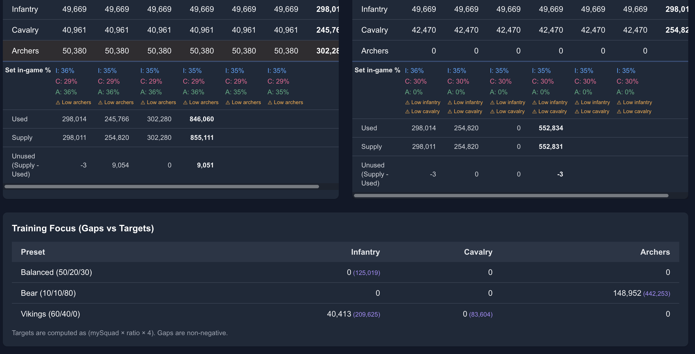

# Kingshot Troop Formation %

Userscript for [Kingshot Guide](https://www.kingshotguide.org/calculator/troops-calculator)'s troop calculator: it injects per-squad formation preset percentages into the Bear and Vikings split tables, warns when any troop type falls below its preset target, recomputes Training Focus gap **cells** and the footer line using your Bear/Viking squad sliders (instead of the site’s fixed ×4), and persists inputs in `localStorage` across sessions.

## Install

[Install](https://github.com/jaredcat/userscripts/raw/refs/heads/main/dist/kingshot-troop-calculator.user.js)

*No userscript manager yet? Install [Violentmonkey](https://violentmonkey.github.io/get-it/) first, then use the link above.*



## Features

- Per-squad formation preset percentages on Bear and Vikings split tables
- Warnings when a troop type is below its preset target
- Training Focus table gaps and explainer use `mySquad × ratio × squads` with squads from the sliders (Balanced = max(Bear, Vikings))
- Input values saved to `localStorage` (`ks-troop-calc-inputs`) between visits

## Supported page

- `https://www.kingshotguide.org/calculator/troops-calculator`

## Development

Build this script only:

```bash
pnpm vite build --mode kingshot-troop-calculator
```

Output: `dist/kingshot-troop-calculator.user.js`.

For local dev with HMR: `pnpm vite --mode kingshot-troop-calculator` (see root `package.json`).
